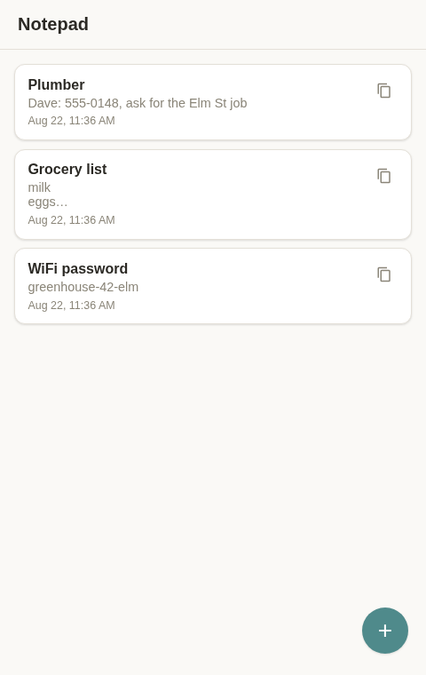
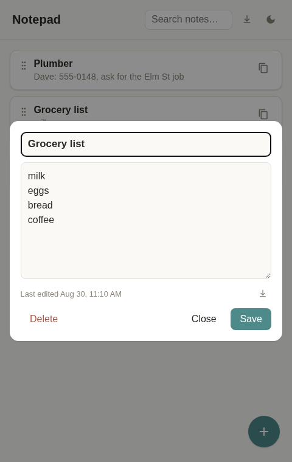
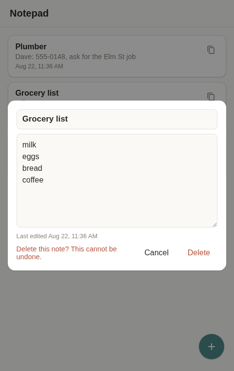

# shared notes

A shared notepad. Notes show up as a scrollable list of cards — tap one to
open and edit it, hit + to add a new one, copy any note's contents with
one tap. Saves sync live to every other open tab over a WebSocket, so two
people looking at the list at once both see changes as they happen.

Built to run on a home LAN, on a machine you already have — Go compiles
to a single static binary, and SQLite is one file, so there's nothing to
install or provision beyond copying the binary over.

## Screenshots

| Notes list | Editing a note | Delete confirmation |
|---|---|---|
|  |  |  |

## How it works

- **Notes are plain text.** Title + body, no markdown rendering — the
  copy button hands you exactly what you typed.
- **Order is manual.** Drag a note by its handle to reorder the list —
  editing a note no longer bumps it to the top; only creating one does
  (new notes appear first). The order syncs live to everyone else too,
  the same way edits do.
- **Live sync is broadcast-on-save**, not collaborative editing: whoever
  saves last wins, and every connected client gets pushed the update over
  `/ws`. No merge conflicts to resolve, no character-level co-editing.
- **Deleting a note is permanent** — no trash, no restore. The one
  built-in safety net is a per-note revision history (last 20 edits, kept
  internally, not exposed in the UI), which protects against overwriting
  a note *while editing it*, not against deleting it on purpose.
- **Periodic backups** snapshot the database to `-backup-dir` (daily by
  default, last 7 kept). Since delete is permanent for the live app but a
  deleted note can still exist in an older snapshot until it ages out,
  "permanent" means immediately gone from the app and its revision
  history — not necessarily from every backup on disk. Shorten the
  retention in `main.go` if that gap matters to you.
- **No accounts.** Anyone who can reach the server can read and edit
  every note — see Hardening below for what that does and doesn't mean
  in practice.

## Setup

1. Build it:
   ```
   go build -o linkshr .
   ```
2. Run it:
   ```
   ./linkshr -addr :8080
   ```
   Then visit `http://<this-machine's-LAN-IP>:8080` from another device
   on the network.

### Flags

| Flag | Default | Meaning |
|---|---|---|
| `-addr` | `:8080` | Address to listen on. Bind to your LAN interface specifically (e.g. `-addr 192.168.1.5:8080`) instead of listening on all interfaces if you'd rather be explicit about it. |
| `-db` | `linkshr.db` | Path to the SQLite database file. |
| `-backup-dir` | `backups` | Where periodic DB snapshots go (empty string disables backups). A snapshot is taken on startup and every 24h; the last 7 are kept. |

## Desktop app

`linkshr-desktop` opens the same UI in a native window instead of a
browser tab — no address bar, its own entry in your app launcher,
otherwise identical. It's a thin client: the server above still does
all the work, this just points a native window at it. Everyone,
including the machine hosting the server, runs this instead of opening
a browser.

Build-time dependencies (Debian/Ubuntu):
```
sudo apt-get install libgtk-3-dev libwebkit2gtk-4.1-dev pkg-config
```
Then build it (note this one needs cgo — unlike the server, it can't
be a fully static binary, since it links against the system's GTK/
WebKit):
```
CGO_ENABLED=1 go build -trimpath -ldflags="-s -w" -o linkshr-desktop ./cmd/linkshr-desktop
```
A prebuilt binary only needs the runtime versions of those libraries
(`libgtk-3-0`, `libwebkit2gtk-4.1-0`) — both already present on most
GTK-based Linux desktops.

Run it pointed at the server (your own machine's `localhost`, or the
host's LAN IP from anywhere else):
```
./linkshr-desktop -server http://192.168.1.5:8080
```

For a real app-launcher entry instead of a terminal command, drop a
`.desktop` file at `~/.local/share/applications/linkshr.desktop`
(no root needed):
```ini
[Desktop Entry]
Type=Application
Name=linkshr
Exec=/home/you/linkshr/linkshr-desktop -server http://192.168.1.5:8080
Terminal=false
Categories=Utility;
```

## Hardening

There's no login, so the usual session/CSRF-token machinery doesn't
apply here — but that doesn't mean skipping basic web hygiene:

- All SQL is parameterized (no injection); note content is only ever
  rendered via `.value`/`.textContent` or explicitly HTML-escaped in the
  frontend (no stored/reflected XSS path).
- `/ws` rejects cross-origin WebSocket upgrade attempts by default (the
  library checks `Origin` against `Host`), so another website open in
  someone's browser can't silently listen in on the live note feed.
- Creating/editing a note requires an exact `application/json`
  Content-Type. This isn't pedantry — without it, a page on some other
  site could blind-POST a look-alike request (`Content-Type: text/plain`
  is a CORS "simple request" the browser sends without asking) and Go's
  JSON decoder doesn't care what Content-Type it arrived with. Requiring
  `application/json` forces a CORS preflight that this server never
  approves, so it can't be forged cross-origin. (`PUT`/`DELETE` were
  already safe this way, since browsers always preflight those methods —
  deleting a note is a `DELETE`, so this covers it too, with no
  restore-style endpoint left as a softer target.)
- Request bodies are capped at 256 KB and the HTTP server has explicit
  read/write/idle timeouts, so a huge or slow-drip request can't exhaust
  memory or tie up the server (doesn't affect `/ws`, which hands its
  connection off to the WebSocket library once upgraded).
- Server errors are logged locally but returned to clients as a generic
  message — internal details (file paths, driver errors) don't leak
  into API responses.
- The process runs under `umask 0077`, so the database file, its WAL/SHM
  files, and every backup snapshot are created readable only by whoever
  runs it — not by other local accounts on the machine. This only
  applies to files created *after* this change; if you already have a
  `linkshr.db` from before, run `chmod 600 linkshr.db` once by hand.

## Running it as a background service

Since this runs on your everyday machine rather than a dedicated server,
it needs to survive you logging out (and ideally restarts if the machine
reboots). A systemd **user** service does this without needing root:

```ini
# ~/.config/systemd/user/linkshr.service
[Unit]
Description=linkshr shared notepad

[Service]
WorkingDirectory=%h/linkshr
ExecStart=%h/linkshr/linkshr -addr :8080
Restart=on-failure

[Install]
WantedBy=default.target
```

(`%h` is systemd's specifier for your home directory — no need to hardcode a path or username.)

Then:
```
systemctl --user daemon-reload
systemctl --user enable --now linkshr
loginctl enable-linger "$USER"   # lets it keep running after you log out
```

Also worth checking your machine's sleep/suspend settings — a sleeping
machine means it can't be reached.
